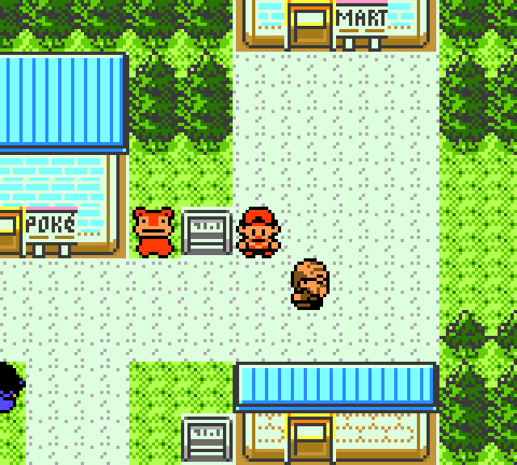

# pokegold-dotnet

**A native Pokemon Gold reimplementation in F# and MonoGame.**

`pokegold-dotnet` turns the pret disassembly and its checked-in source assets
into a typed, platform-independent game engine with a native desktop host.
Maps, scripts, battles, encounters, graphics, palettes, saves, and audio are
baked directly from repository source data at build time.



The active implementation lives in [`engine-dotnet`](engine-dotnet/). It pairs
an F# game library with a MonoGame DesktopGL host and a deterministic headless
runtime used for route and conformance testing.

## Current status

Development is active. The engine currently has:

- A script-VM story proof from the New Bark bedroom through post-Red credits.
- An authenticated fresh-save runtime route through the rival, Elm's egg
  handoff, Routes 30/31, and an earned Violet City checkpoint.
- Source-backed overworld palettes, map rendering, movement, collision, warps,
  objects, encounters, field moves, menus, saves, audio, and battle systems.
- Persistent Pokemon identity and source-based stats, progression, trainer AI,
  battle items, blackout, save/reload, and retry behavior.
- More than 1,500 xUnit tests across data generation, conformance, isolated
  systems, staged runtime behavior, and continuous-route checkpoints.

The completion gate is one fresh-save, glitchless runtime route through Red,
driven by ordinary input with earned state and persistent checkpoint ancestry.
The Azalea GIF above demonstrates the native renderer; route completion is
tracked independently by the continuous runtime tests.

See [`docs/status.md`](docs/status.md) for the concise handoff status and
[`docs/plan/`](docs/plan/) for the detailed milestone and victory plans.

## Architecture

- `engine-dotnet/src/PokeGold.Game` is the platform-independent F# game library.
- `engine-dotnet/src/PokeGold.Host` presents the engine through MonoGame
  DesktopGL.
- Build-time data generation reads checked-in disassembly/source assets from
  `constants/`, `data/`, `maps/`, `gfx/`, and `audio/`.
- The test suite covers graphics/data parsing, map rendering, collision,
  movement, scripts, story gates, battles, save/load, audio, menus, field moves,
  encounters, party/bag/storage systems, and conformance ledgers.
- Continuous-route tests can persist ordinary runtime save files as durable
  checkpoints and verify their SHA-256-backed ancestry before resuming.
- Repository source assets produce a self-contained desktop runtime.

## Current boundaries

- The authenticated continuous route currently reaches Violet City; later
  Johto, Kanto, and Red checkpoints remain active integration work.
- Golden-route coverage leads development, followed by alternate starters,
  detours, unusual menu sequences, and broader completion play.
- Gameplay and source behavior take priority over frame-perfect hardware timing.
- Windows desktop is the primary validated host. Android development uses its
  separate SDK-gated project.

## Build

Run the targeted desktop projects from `engine-dotnet`. The complete solution
also includes the Android SDK-gated host.

```powershell
cd engine-dotnet
dotnet build .\src\PokeGold.Game
dotnet build .\src\PokeGold.Host
```

Building `PokeGold.Game` also runs the build-time data generator when its inputs
or outputs require it.

## Test

```powershell
cd engine-dotnet
dotnet test .\tests\PokeGold.Tests
```

For focused work, prefer the smallest relevant test project or test filter first,
then run the full test project when the change affects shared behavior.

## Run the MonoGame host

If your machine has the .NET SDK and desktop graphics support needed by
MonoGame DesktopGL:

```powershell
cd engine-dotnet
dotnet run --project .\src\PokeGold.Host
```

The host runs the native .NET engine directly from baked repository source
assets.

## Repository layout

```text
engine-dotnet/
  PokeGold.slnx
  src/
    PokeGold.Game/          F# platform-free game/runtime library
    PokeGold.Host/          MonoGame DesktopGL host
    PokeGold.Host.Android/  Android host; requires Android SDK
    PokeGold.MapData/       Shared map/script data model and parsers
  tests/PokeGold.Tests/     xUnit verification suite
  tools/PokeGold.DataGen/   Build-time source-data generator

audio/, constants/, data/, engine/, gfx/, maps/
  Disassembly/source assets used as the .NET engine's data source

docs/status.md              Current concise project status
docs/plan/                  Detailed milestone, victory, and agent handoff docs
```

## Legal and asset note

This repository is based on the reverse-engineered pret Pokemon Gold
disassembly and its checked-in source assets. Pokemon and related properties
belong to Nintendo, Game Freak, Creatures, and The Pokemon Company. This is an
independent, non-commercial fan project maintained separately from pret.

## Contributing

Most active work should happen under `engine-dotnet`. Before changing behavior,
read the relevant `.asm` source in this repository and preserve behavior over
clever refactors. Keep generated code, source assets, and runtime code clearly
separated; repository source assets remain the engine's data boundary.

Use [`AGENTS.md`](AGENTS.md) for coding-agent handoff rules. Use
[`docs/plan/victory-plan.md`](docs/plan/victory-plan.md) for the route gate and
[`docs/plan/plan.md`](docs/plan/plan.md) for the longer milestone history.
